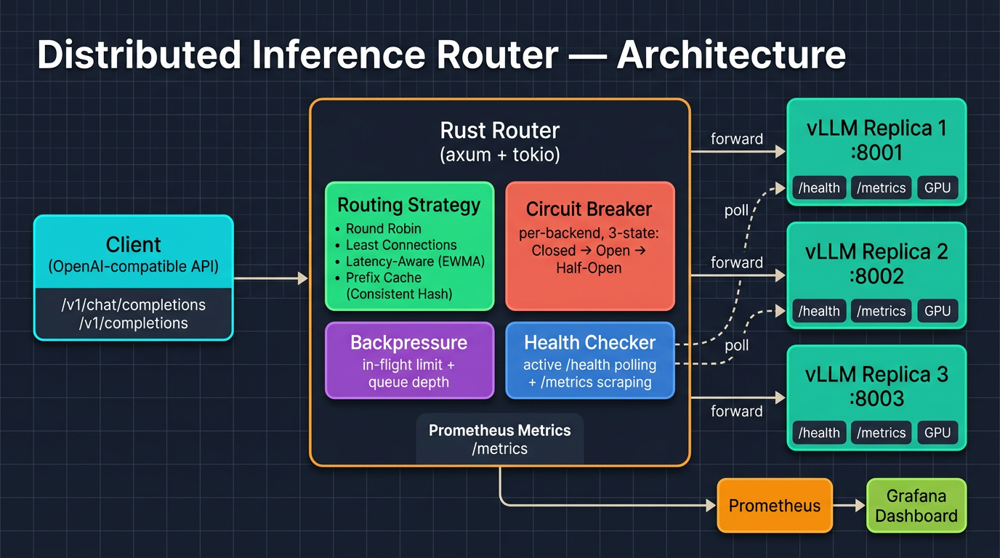

# Distributed Inference Router

A high-performance request routing layer for distributing LLM inference requests across multiple [vLLM](https://github.com/vllm-project/vllm) replicas. Written in Rust (hot path) and Python (benchmarking/tooling).

## Features

- **Pluggable routing strategies**: Round-robin, least-connections, latency-aware (EWMA), prefix-cache-aware (consistent hashing)
- **Circuit breakers**: Per-backend 3-state circuit breaker (Closed → Open → Half-Open) with configurable failure rate thresholds
- **Backpressure**: In-flight request limiting with 429 rejection; backend queue depth awareness via `/metrics` scraping
- **Health checking**: Active polling of backend `/health` endpoints + passive failure tracking from proxied requests
- **Prometheus observability**: Request counters, latency histograms, circuit breaker state, backend health gauges
- **SSE streaming**: Full support for `stream: true` chat/completion requests
- **Grafana dashboard**: Pre-built dashboard with request rate, latency percentiles, circuit breaker state, and backend health panels

## Architecture



## Routing Strategies

| Strategy | Description | Best For |
|----------|-------------|----------|
| `round_robin` | Cycles through healthy backends | Even distribution, simple setups |
| `least_connections` | Picks backend with fewest active connections | Uneven request durations |
| `latency_aware` | EWMA-weighted random selection (α=0.3) | Heterogeneous GPU hardware |
| `prefix_cache` | Consistent hashing on prompt prefix (SHA-256) | Maximizing vLLM KV cache hits |

## Quick Start

### Local Development (mock backends, no GPU required)

```bash
cd deploy
docker compose -f docker-compose.mock.yml up --build
```

This starts:
- 3 mock vLLM backends (ports 8001-8003)
- The inference router (port 8080)
- Prometheus (port 9090)
- Grafana (port 3000, login: admin/admin)

Test it:

```bash
curl http://localhost:8080/v1/chat/completions \
  -H "Content-Type: application/json" \
  -d '{"model": "mock-model", "messages": [{"role": "user", "content": "Hello!"}], "max_tokens": 50}'
```

### GPU Deployment (real vLLM)

```bash
# Set your model
export MODEL_NAME=meta-llama/Llama-3.1-8B-Instruct

cd deploy
docker compose up --build
```

## Configuration

See [`config.example.yaml`](config.example.yaml) for the full configuration reference.

```yaml
listen:
  host: "0.0.0.0"
  port: 8080

routing:
  strategy: "latency_aware"

backends:
  - url: "http://vllm-1:8000"
  - url: "http://vllm-2:8000"
  - url: "http://vllm-3:8000"

circuit_breaker:
  failure_rate_threshold: 0.5
  open_duration_secs: 30

backpressure:
  max_in_flight: 1000
```

## Benchmarking

Run the load test against the router:

```bash
cd benchmarks
pip install -e .

# Baseline test
python load_test.py --url http://localhost:8080 --concurrency 50 --requests 2000 --strategy round_robin --output rr_results.json

# Compare strategies
python load_test.py --strategy round_robin --output rr.json
python load_test.py --strategy least_connections --output lc.json
python load_test.py --strategy latency_aware --output la.json
python load_test.py --strategy prefix_cache --output pc.json

# Generate comparison plots
python analyze.py rr.json lc.json la.json pc.json --output plots/
```

### Scenario-based Tests

```bash
# Baseline (all healthy)
python load_test.py --scenario scenarios/baseline.yaml --output baseline.json

# Failover (kill a backend during the test)
python load_test.py --scenario scenarios/failover.yaml --output failover.json

# Saturation (overwhelm with requests)
python load_test.py --scenario scenarios/saturation.yaml --output saturation.json
```

## Testing

### Unit Tests (Rust)

```bash
cd router-core
cargo test
```

### Integration Tests

```bash
# Start the stack first
cd deploy && docker compose -f docker-compose.mock.yml up -d

# Run integration tests
pip install -r tests/requirements.txt
pytest tests/integration/ -v

# Run failover tests
pytest tests/failover/ -v -s
```

## Prometheus Metrics

The router exposes metrics at `/metrics`:

| Metric | Type | Description |
|--------|------|-------------|
| `router_requests_total` | Counter | Total requests by strategy, backend, status |
| `router_request_duration_seconds` | Histogram | Request latency by backend |
| `router_active_connections` | Gauge | Active connections per backend |
| `router_circuit_breaker_state` | Gauge | 0=closed, 1=half_open, 2=open |
| `router_backend_health` | Gauge | 0=down, 1=up |
| `router_rejected_requests_total` | Counter | Rejected requests by reason |

## Project Structure

```
├── router-core/           Rust crate (axum + tokio)
│   └── src/
│       ├── main.rs           Entry point
│       ├── config.rs          YAML config parsing
│       ├── server.rs          HTTP handlers
│       ├── proxy.rs           Reverse proxy + SSE streaming
│       ├── backend.rs         Backend state management
│       ├── routing/           Strategy implementations
│       ├── circuit_breaker.rs Per-backend circuit breaker
│       ├── backpressure.rs    In-flight request limiting
│       ├── health.rs          Active health checker
│       └── metrics.rs         Prometheus metrics
├── mock-backend/          Python mock vLLM server
├── benchmarks/            Load testing + analysis
├── deploy/                Docker Compose + Prometheus + Grafana
└── tests/                 Integration + failover tests
```

## Stack

- **Rust** (axum, tokio, reqwest) — router hot path
- **Python** (FastAPI, aiohttp, matplotlib) — mock server, benchmarks, tests
- **vLLM** — LLM inference backend
- **Docker Compose** — deployment orchestration
- **Prometheus + Grafana** — observability
